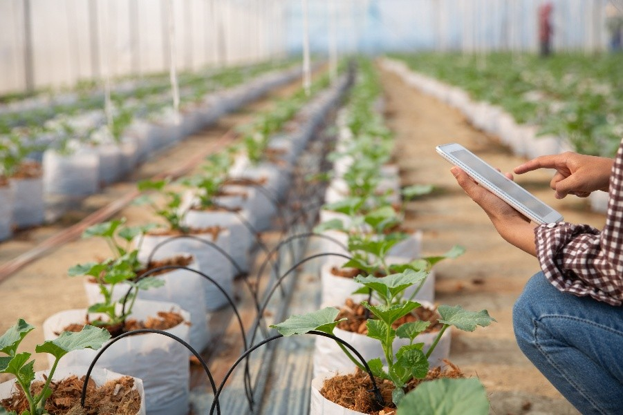
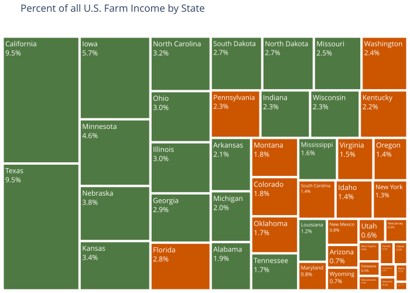

Advances in technology have led to the rise in a new era for genetically engineered crops in the U.S., which include incredible enhancements in herbicide-tolerant, insect-resistant, and nutritionally enhanced crops. While these innovations have greatly improved agricultural productivity, they raise a number of long-term health, environmental, and ethical considerations [@bawa2013genetically].

                                        By Maura Mann

{width=100%}

## Differing Research Priorities

We can look at the rise of genetically engineered crops through multiple angles and begin to understand how they took off in the first place. One of the reasons we have the technology to develop these types of crops is from the extensive resources dedicated towards making advancements in this field. While the total public sector agricultural and food research and development expenditure (adjusted for inflation) has decreased since the early 2000s, the private sector total food research and development expenditure (adjusted for inflation) has continued to rise.


Decreases in public sector spending mean focuses such as food safety and regulations have taken a back seat to private sector focuses such as farm productivity, increasing crop protection, and optimizing food manufacturing processes. This has led to concerns over the lack of national body governing food systems and farmers being limited to growing private sector developed genetically engineered crops [@fuglie2016growing].

## Genetic Engineering: A Timeline

There are eleven genetically engineered crops that are available in the United States. They include corn, cotton, soybeans, canola, alfalfa, sugar beets, papaya, potatoes, apples, pineapples, and squash. When these crops are engineered, breeders identify genome variations of the crop that are most desirable. This informs the cross-breeding process where the ideal plants are created that can often avoid disease, insects, and prevent weed growth. Additionally, genetically engineering crops can make them last longer for the consumer such as some genetically engineered potatoes, which can be resistant to browning and bruising while they're being transported and even when cut in the kitchen [@U.S.Food&Drug].

It wasn't always that genetically engineered crops made up the majority percentage of certain crops. Using corn as a case study, high corn producing states didn't start to plant mostly genetically engineered corn until around the early 2010s.

```{=html}
<iframe src="plots/plot2.html" width="90%" height="500px" frameborder="0" style="display:block; margin: 0 auto;"></iframe>
```

However, ever since this trend towards planting genetically engineered corn started, there has not been a decrease since.

In order to get a better picture, however, it's important to look at the trend of other crops in comparison. As seen below when comparing to corn, both cotton and soybeans had an even quick rise in the amount of genetically engineered crop that was being planted.

```{=html}
<iframe src="plots/plot3.html" width="85%" height="500px" frameborder="0" style="display:block; margin: 0 auto;"></iframe>
```

It wouldn't be accurate to leave the analysis at just showing the increasing rise of planted genetically engineered crops. While what's shown above shows all genetically engineered varieties, we can narrow in on one type of genetically engineered trait and show how even within corn, cotton, and soybeans, industry trends change over time.

Click on one of the crop by state bars to see its trend in U.S. farming over time.

```{=html}
<iframe src="plots/plot4.html" width="100%" height="800px" frameborder="0" style="display:block; margin: 0 auto;"></iframe>
```

While herbicide-tolerant engineered crops make up most of the current soybeans planted in the U.S., the same type of engineered crop has declined in recent years for corn and cotton. It turns out that there are cheaper ways to control weeds in corn and cotton fields due to way they're planted and how the fields can be maintained. The same cannot be said for soybeans and planting herbicide-tolerant crops has become the standard across the country [@USDA]. Therefore, the type of genetically engineered plants are highly dependent on profit margins regardless of the developments in technology.

## Financial Considerations

As seen above, there are financial considerations when it comes to planting some genetically engineered crops. However, they have transformed the agriculture industry on the both the manufacturing and consumer fronts. The U.S. farm income industry is huge, bringing in $1.53 trillon dollars in 2023, accounting for 5.3% of total GDP [@U.S.Chamber]. Some of the states with the largest farm-income are also some of the largest when it comes to planting genetically engineered corn, cotton, and soybeans.



## Summary

Crop genetic engineering has transformed the agricultural and food industry from the early 2000s to now. While the crop footprint is small, more crops may become genetically enhanced as advancements are made. However, as many benefits are they bring, there remains public concern about their long-term harm.

```{=html}
<iframe src="plots/plot6.html" width="100%" height="800px" frameborder="0" style="display:block; margin: 0 auto;"></iframe>
```

Note: The only crops considered in the plots above are corn, cotton, and soybeans.